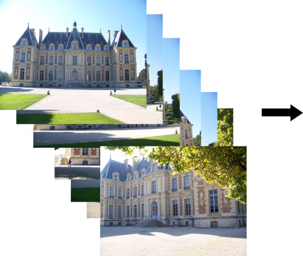

# bluejay

You may need to grant X-server permission so your Docker container GUI app can run:
```bash
xhost +
```
Build and enter the Docker container if you have not done so:
```bash
git clone git@github.com:jambamamba/bluejay.docker.git
cd bluejay.docker
docker build -t bluejay .
./enterdocker.sh
```
Next buid BlueJay:
```bash
git clone https://github.com/jambamamba/bluejay.git
cd bluejay
./build.sh

./run.sh ~/$DOCKERUSER/bluejay/images/SceauxCastle/ /tmp/output/SceauxCastle
```


The output is generated in /tmp/output.
When you exit the Docker container, it is destroyed. So if you want to keep it, then copy /tmp/output/SceauxCastle to some other persistent location

You can also view the generated 3d model (ply file) in Meshlab or Blender

https://www.meshlab.net/#download

